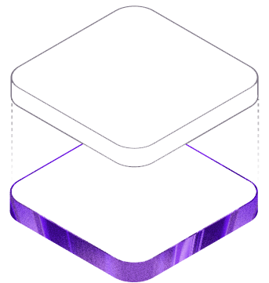

<p align="center">
  <a href="#industrial-3d-digital-twin-dashboard"><b>🇬🇧 English</b></a> · <a href="#versión-en-español"><b>🇪🇸 Español</b></a>
</p>

<h1 align="center">🏭 Industrial 3D Digital Twin Dashboard</h1>

<p align="center">
  A real-time warehouse digital twin built with <b>Three.js</b> — <b>256 live inventory slots rendered in a single draw call</b>, with a GPU-composited dashboard overlay and cinematic camera choreography.
</p>

<p align="center">
  
  
  
  
  
  
  
</p>

<p align="center">
  
</p>

---

## 📋 Overview

This project is an **industrial-grade 3D digital twin** of an automated warehouse. It simulates live telemetry (stock fluctuations, anomalies, alerts) and visualizes it on a procedurally generated 3D warehouse where every pallet slot is an interactive, data-driven entity.

It was engineered as a showcase of **real-time 3D performance techniques**: GPU instancing, allocation-free render loops, and compositor-only UI — the same discipline required by large-scale industrial SCADA and digital-twin applications.

## ✨ Features

- 🏭 **Procedural warehouse** — 4 aisles × 2 rows × 8 positions × 4 levels = **256 slots**, deterministically generated with a seeded PRNG (mulberry32)
- 🖱️ **Raycast interaction** — hover highlight + click-to-select with a cinematic GSAP camera fly-to
- 🎯 **Floating tooltip** — anchored to the 3D slot via world→screen projection, tracking the camera in real time
- 📡 **Telemetry simulator** — 30-second tick cycle, ~30 slots updated per tick, with configurable anomaly probabilities
- 🚨 **Live alerting** — status-driven colors, LED-style bloom on warning/error states, toast notifications and alert history
- 🎛️ **Row filtering** — F1–F8 filter bar with zero-cost visibility toggling (instance matrix scaling, no geometry churn)
- 📷 **Bounded OrbitControls** — industrial navigation limits: no floor clipping, clamped zoom, damped inertia
- ⏸️ **Energy-aware loop** — the render loop auto-pauses when the tab is hidden (Page Visibility API)
- 🧹 **Leak-free lifecycle** — every system exposes `dispose()`; WebGL contexts, listeners and timers are fully released

## 📊 Performance Metrics

| 🚀 Metric | 🎯 Result | 🔧 How we achieve it |
|---|---|---|
| **Frame rate** | **+60 FPS stable** | Clamped-delta `requestAnimationFrame` loop, pixel-ratio cap (2×), bloom rendered at half resolution |
| **Draw calls** | **1 single draw call** for all **256 containers** | One `THREE.InstancedMesh` with a per-instance color buffer — no mesh duplication |
| **Garbage collection** | **Zero-Allocation** in the render loop | Object Pooling: recycled `THREE.Color` scratch objects + pre-allocated `Uint16Array` pools |
| **UI ↔ 3D latency** | **Sub-50 ms** (imperceptible) | GPU-accelerated projections: `Vector3.project()` → `translate3d()` + `will-change` |

## ⚙️ Architecture & Optimization

> **Design principle:** the render loop is sacred. Anything that allocates on the hot path is forbidden by design — garbage collection pauses are a frame-killer at 60 FPS.

```
┌───────────────────────────── EventBus (typed pub/sub) ─────────────────────────────┐
│                                                                                    │
│  DataSimulator ──warehouse:stock-updated──▶ WarehouseGrid (3D) + UIManager (UI)    │
│  Interaction ────warehouse:slot-clicked───▶ CameraController (GSAP) + UIManager    │
│  Engine ────────sim:tick──────────────────▶ CameraController, UIManager            │
└────────────────────────────────────────────────────────────────────────────────────┘
```

### 🧊 `InstancedMesh` — 256 slots, 1 draw call

The entire warehouse is a **single `THREE.InstancedMesh`** ([`WarehouseGrid.ts`](src/systems/WarehouseGrid.ts)): one shared `BoxGeometry`, one shared `MeshStandardMaterial`, and 256 instance matrices uploaded once to the GPU. Instead of 256 meshes (which would issue 256 draw calls and collapse under draw-call overhead), the GPU renders every slot in **one draw call**.

- Per-instance status colors are written to the `instanceColor` buffer — `NORMAL` (emerald), `WARNING` (amber), `ERROR` (red), `EMPTY` (slate) — so state changes are a buffer write + `needsUpdate`, never a material swap.
- **Row filtering is free:** visibility is toggled by scaling instance matrices to `(0,0,0)`. No geometry is created or destroyed — a single `instanceMatrix.needsUpdate = true` uploads the change.

### ♻️ Object Pooling — Zero-Allocation hot paths

The `mousemove` hover handler and the simulation tick are **allocation-free by contract**:

- **Recycled color objects** — `_tempColor` (per-instance, reused in-place) and a static `_WHITE` shared by all instances. `new THREE.Color()` in the hover path is *forbidden* — the highlight is computed via `lerp()`/`multiplyScalar()` into the pooled object.
- **Pre-allocated typed-array pools** — the simulator's slot-selection algorithm ([`DataSimulator.ts`](src/systems/DataSimulator.ts)) runs a partial Fisher-Yates shuffle over a `Uint16Array` pool allocated once in the constructor and reset with a plain `for` loop each tick. Zero array allocations, zero `.map()`/`.filter()` in the simulation path.
- **Pooled transform scratch objects** — matrix/position/`Object3D` scratch objects reused across all filter operations.

Result: no garbage-collection pressure from the render or simulation loops — stable frame pacing regardless of interaction load.

### 📐 3D→2D Projection — GPU-composited UI

The dashboard tooltip lives in DOM-space but is **anchored to a 3D world position** ([`UIManager.ts`](src/ui/UIManager.ts)):

1. `Vector3.project(camera)` transforms the slot's world position into **NDC** (−1…1)
2. NDC is mapped to **viewport CSS pixels**
3. The tooltip is positioned with `transform: translate3d(x, y, 0)` + `will-change: transform, opacity` — a **compositor-only** operation

Using `left`/`top` would trigger synchronous layout (forced reflow) on every frame. `translate3d()` keeps the entire animation on the GPU compositor thread. While the tooltip is open, it is **re-projected every frame**, so it tracks the slot perfectly as the user orbits the camera.

### 🎬 Render pipeline (supporting cast)

| Technique | Implementation |
|---|---|
| **Post-processing** | `EffectComposer` + `UnrealBloomPass` at **half resolution** (≈4× cheaper); threshold `0.65` so only warning/error slots emit the LED glow |
| **Tone mapping** | ACES Filmic for a cinematic industrial look |
| **Shadows** | PCFSoft shadow maps (2048²), directional + ambient + fill lighting |
| **Frame stability** | `delta` clamped to `0.1` (no spiral-of-death after tab switches), pixel ratio capped at `2` |
| **Camera** | GSAP-driven fly-to with `power3.out` easing — position and target animated through a proxy object, previous tween killed on re-entry |
| **Decoupling** | A fully-typed `EventBus` (compile-time-checked payloads, `once()` listeners, bulk `dispose()`) keeps the 3D layer blind to the DOM layer |

## 🧰 Tech Stack

| Technology | Version | Role |
|---|---|---|
| [Three.js](https://threejs.org/) | 0.184 | WebGL rendering, `InstancedMesh`, post-processing |
| [TypeScript](https://www.typescriptlang.org/) | 6.0 | Strict, fully-typed codebase |
| [Vite](https://vitejs.dev/) | 8.0 | Dev server & production bundling |
| [Tailwind CSS](https://tailwindcss.com/) | 3.4 | Utility-first UI layer |
| [GSAP](https://gsap.com/) | 3.15 | Cinematic camera transitions |
| PostCSS + Autoprefixer | — | CSS pipeline |

## 📁 Project Structure

```
dashboard-3d/
├── index.html                  # Dashboard shell: canvas + overlay UI
├── package.json
├── tailwind.config.js
├── postcss.config.js
├── tsconfig.json
├── public/                     # favicon & icon sprite
└── src/
    ├── main.ts                 # Composition root — wires all systems
    ├── style.css
    ├── assets/
    ├── core/
    │   ├── Engine.ts           # WebGL renderer, bloom pipeline, game loop
    │   └── CameraController.ts # OrbitControls + GSAP cinematic fly-to
    ├── systems/
    │   ├── EventBus.ts         # Typed pub/sub — decouples 3D from UI
    │   ├── WarehouseGrid.ts    # InstancedMesh warehouse (256 slots, 1 draw call)
    │   ├── DataSimulator.ts    # Telemetry simulation (zero-alloc pools)
    │   └── Interaction.ts      # Raycaster hover/click picking
    ├── types/                  # Shared domain & event types
    └── ui/
        └── UIManager.ts        # Overlay UI, 3D→2D tooltip projection
```

## 🚀 Getting Started

### Prerequisites

- **Node.js ≥ 20.19** (required by Vite 8)
- npm (bundled with Node.js)

### Installation & local run

```bash
# 1. Install dependencies
npm install

# 2. Start the dev server
npm run dev
# → http://localhost:5173

# 3. Production build (type-check + bundle)
npm run build
# → dist/

# 4. Preview the production build locally
npm run preview
```

## 🎮 Controls

| Action | Input |
|---|---|
| Orbit the warehouse | Left-drag |
| Pan | Right-drag |
| Zoom | Scroll wheel |
| Select a slot | Click → cinematic fly-to + floating tooltip |
| Deselect | `Esc` or click on empty space |
| Filter rows | F1–F8 buttons |
| Reset camera | 🌐 *Vista Global* |

## 🗺️ Future Work

- [ ] OPC-UA / WebSocket ingestion for real telemetry instead of simulated data
- [ ] Multi-warehouse scene management
- [ ] Web Worker-based simulation for 10k+ instance scale
- [ ] Mobile & VR interaction pass

---

## 📄 License

Distributed under the **MIT License**. See [LICENSE](LICENSE) for details.

---

## 👤 Author

**Guillermo Leonel Vásquez López** — [GitHub](https://github.com/TU_USUARIO) · [LinkedIn](https://www.linkedin.com/in/TU_PERFIL)

*Reach out if you'd like to discuss real-time 3D, digital twins, or this project.*

---

## 🇪🇸 Versión en Español

### 🏭 Gemelo Digital Industrial 3D — Tablero en tiempo real

Tablero de gemelo digital para un almacén industrial: **256 slots de inventario renderizados en una sola draw call**, con telemetría simulada en tiempo real, overlay de dashboard compuesto por GPU y transiciones de cámara cinematográficas.

### ✨ Características

- 🏭 **Almacén procedural** — 4 pasillos × 2 filas × 8 posiciones × 4 niveles = **256 slots**, generados con PRNG con semilla (mulberry32)
- 🖱️ **Interacción por raycasting** — resaltado al pasar el mouse + clic con vuelo de cámara animado (GSAP)
- 🎯 **Tooltip flotante** anclado a la posición 3D mediante proyección mundo→pantalla, sigue a la cámara en tiempo real
- 📡 **Simulador de telemetría** — ciclo de 30 s, ~30 slots actualizados por tick, con probabilidades de anomalía configurables
- 🚨 **Alertas en vivo** — colores por estado, bloom LED en warning/error, toasts e historial de alertas
- 🎛️ **Filtro de filas** (F1–F8) con ocultamiento a costo cero (escala de matrices de instancia)
- ⏸️ **Bucle consciente de energía** — pausa automática al cambiar de pestaña (Page Visibility API)
- 🧹 **Sin fugas de memoria** — todos los sistemas exponen `dispose()`

### ⚙️ Arquitectura y optimización

**🧊 `InstancedMesh` — 256 slots, 1 draw call.** Todo el almacén es un único `THREE.InstancedMesh` ([WarehouseGrid.ts](src/systems/WarehouseGrid.ts)): una geometría compartida, un material compartido y 256 matrices de instancia subidas una sola vez a la GPU. Los colores por estado se escriben en el buffer `instanceColor`; el filtrado de filas solo escala matrices a `(0,0,0)` — sin crear ni destruir geometría.

**♻️ Object Pooling — Zero-Allocation en el hot path.** El handler de `mousemove` y el tick de simulación están libres de asignaciones por contrato: colores reciclables (`_tempColor`, `_WHITE` estático) y pools `Uint16Array` pre-asignados para el shuffle Fisher-Yates parcial del simulador ([DataSimulator.ts](src/systems/DataSimulator.ts)). Cero presión del garbage collector sobre el render loop.

**📐 Proyección 3D→2D — UI acelerada por GPU.** El tooltip vive en el DOM pero se ancla a coordenadas del mundo: `Vector3.project(camera)` → NDC → píxeles CSS, posicionado con `translate3d()` + `will-change` (solo compositor, sin reflow). Mientras está abierto, se re-proyecta cada frame y sigue al slot durante la órbita.

**🎬 Extras del pipeline:** bloom UnrealBloomPass a media resolución (umbral 0.65 — solo las alertas emiten resplandor LED), tone mapping ACES, sombras PCFSoft, delta con clamp y un bus de eventos tipado (`EventBus`) que desacopla completamente la capa 3D de la UI.

### 📊 Métricas de rendimiento

| 🚀 Métrica | 🎯 Resultado | 🔧 Técnica |
|---|---|---|
| **Fotogramas** | **+60 FPS estables** | Loop `requestAnimationFrame` con delta limitado, pixel ratio ≤ 2, bloom a media resolución |
| **Draw calls** | **1 sola** para los **256 contenedores** | `InstancedMesh` único con buffer de color por instancia |
| **Recolección de basura** | **Zero-Allocation** en el render loop | Object Pooling: objetos reciclados + pools tipados pre-asignados |
| **Latencia UI ↔ 3D** | **Sub-50 ms** (imperceptible) | Proyecciones aceleradas por GPU (`translate3d` + `will-change`) |

### 🚀 Instalación y ejecución

```bash
# 1. Instalar dependencias
npm install

# 2. Servidor de desarrollo
npm run dev
# → http://localhost:5173

# 3. Build de producción (verificación de tipos + bundle)
npm run build

# 4. Previsualizar el build de producción
npm run preview
```

> Requisitos: **Node.js ≥ 20.19**

### 🎮 Controles

| Acción | Entrada |
|---|---|
| Orbitar el almacén | Arrastrar con clic izquierdo |
| Desplazamiento lateral | Arrastrar con clic derecho |
| Zoom | Rueda del mouse |
| Seleccionar un slot | Clic → vuelo cinematográfico + tooltip |
| Deseleccionar | `Esc` o clic en espacio vacío |
| Filtrar filas | Botones F1–F8 |
| Restablecer cámara | 🌐 *Vista Global* |

### 👤 Autor

**Guillermo Leonel Vásquez López** — [GitHub](https://github.com/TU_USUARIO) · [LinkedIn](https://www.linkedin.com/in/TU_PERFIL)
